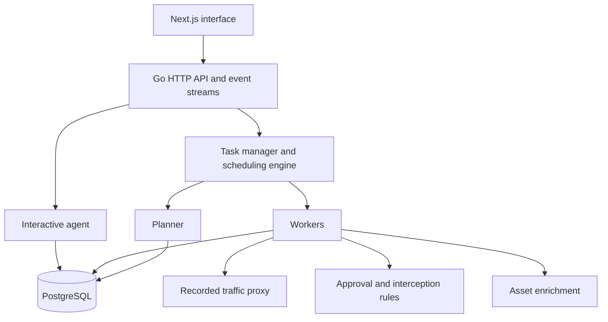
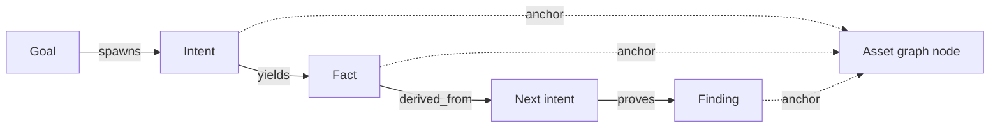

# Application architecture

ARTEX combines a Next.js interface, a Go HTTP server, PostgreSQL, and agents built with the [norma SDK](https://github.com/Autumn-27/norma). The frontend can be exported as static files and embedded in the Go binary. The server manages tasks, authentication, event streams, and agent execution.

## Data model

The application maintains two related graphs in PostgreSQL:

| Graph | Scope | Contents |
| --- | --- | --- |
| Asset graph | Shared across tasks | Domains, subdomains, IP addresses, services, applications, and endpoints |
| Exploration graph | One per task | Goals, intents, facts, findings, hints, activity, and the relationships between them |

`exploration_anchors` connects an exploration node to an asset. The connection supports navigation from an asset to its task activity and from an intent or finding to the affected assets. The interface uses those records for asset coverage views.

## Execution

Each task has a planner loop and worker routines. Graph updates wake the planner. The planner reads task scope, graph state, and coverage, then adds eligible intents to a frontier queue. A worker claims one intent, executes its assigned work, and records resulting activity, facts, assets, and findings. Those writes can prompt another planning round. The planner may add no intents during a round if the graph presents no new direction.

Workers can inspect activity from other workers in the same task through `search_all_worker_traces`, `list_worker_traces`, and `get_worker_trace`. These tools expose observations that have not been promoted to formal facts. The planner also retains a task level checklist across its sessions, so it can track dependencies between successive intents.

## Supporting services

| Component | Role |
| --- | --- |
| `traffic/` and `evidence/` | Captured requests, responses, and evidence records |
| `guard/` and `intercept/` | Tool approvals and interception rules |
| `enrich/` | Asynchronous asset enrichment |
| `skills/` and `mcphttp/` | Agent instructions and external tool integration |
| `report/` | Finding reports |

The [deployment guide](../infra/README.md) describes the integrated container stack and cloud infrastructure. The [main README](../README.md) provides the license, usage conditions, and local build instructions.
